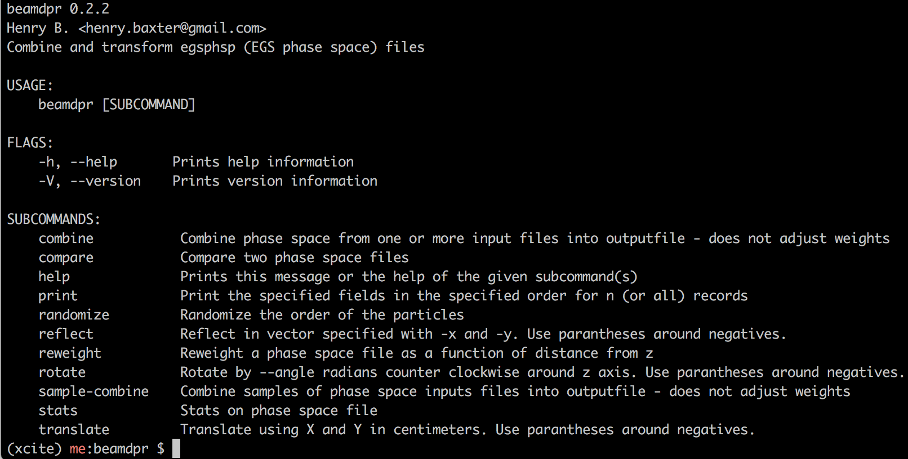

# beamdpr

Combine and transform egsphsp (EGS phase space) files.

[](https://github.com/henrybaxter/beamdpr/graphs/commit-activity)
[](https://crates.io/crates/beamdpr)



## How it works

```

    $ beamdpr translate -i first.egsphsp1 -x 2.3

```

Now `first.egsphsp1` has been translated 2.3 cm in the positive x direction.

# Installation

Homebrew:

```

    brew tap henrybaxter/tap
    brew install beamdpr

```

Anything else:

1. Install rust for your system

   https://www.rust-lang.org/en-US/downloads.html

2. Install `beamdpr` using `cargo`

   `cargo install beamdpr`

3. All done. `beamdpr` should work. If not, [please file an issue!](https://github.com/henrybaxter/beamdpr/issues/new>)

# Usage

Start by typing `beamdpr` at the terminal/command line. If that does not work, go back to the installation step. Still no dice? [Please file an issue!](https://github.com/henrybaxter/beamdpr/issues/new)

## Combine

Assume these are your files:

```

    $ ls
    first.egsphsp1 second.egsphsp1

```

Make a combined version:

```

    $ beamdpr combine *.egsphsp1 -o combined.egsphsp1

```

And there it is:

```

    $ ls
    combined.egsphsp1 first.egsphsp1 second.egsphsp1

```

**NOTE:** This will work with any number of files, as long as their mode matches. That means either they all have ZLAST or none of them do.

## Sample-Combine

```

    $ ls
    first.egsphsp1 second.egsphsp1

```

Take a sampling of 1 in 10 particles from each file

```

    $ beamdpr sample-combine *.egsphsp1 -o combined.egsphsp1 --rate 10
    $ du -sh *
    256K    first.egsphsp1
    256K    second.egsphsp1
    52K     combined.egsphsp1

```

Notice that we have divided the total space by 10.

## Translate

Let's assume this is your file:

```

    $ ls
    first.egsphsp1

```

Now translate it 23 in the x direction and -5.7 in the y:

```

    $ beamdpr translate first.egsphsp1 translated.egsphsp1 -x 23 -y -5.7

```

And there you have it:

```

    $ ls
    first.egsphsp1 translated.egsphsp1

```

**NOTE:** You may omit an argument if you only want to translate in one direction.

## Rotate

Let's assume this is your file:

```

    $ ls first.egsphsp1
    first.egsphsp1

```

Now rotate .9 radians in the counter-clockwise direction:

```

    $ beamdpr rotate first.egsphsp1 rotated.egsphsp1 --angle .9

```

It's all done!

```

    $ ls
    first.egsphsp1 rotated.egsphsp1

```

**NOTE:** If you rotate by 2π (6.28318530718) the file should be unchanged right? Not quite. Due to floating point vagaries there will be minor binary differences, but the value differences will be negligible.

## Reflect

Let's assume this is your file:

```

    $ ls first.egsphsp1
    first.egsphsp1

```

Now reflect around the vector (1, 0):

```

    $ beamdpr rotate first.egsphsp1 reflected.egsphsp1 -x 1

    $ ls
    first.egsphsp1 reflected.egsphsp1

```

**NOTE:** This effectively changed the sign of all y values and y directions.

## In-place

Any of these transform operations can be done **in-place** - that is, by modifying the input file, rather than creating a new one:

```

    $ ls first.egsphsp1
    first.egsphsp1

```

Reflect in the vector (-1, 0) in-place:

```

    $ beamdpr rotate first.egsphsp1 -i -x -1


```

**NOTE:** The flag `-i` is the same as `--in-place`.

## Delete after reading

During a combine operation you may worry about disk space (10x10gb of phase space files could add another 100gb of combined phase space files). Let's delete as we go:

```

    $ ls
    first.egsphsp1 second.egsphsp1

```

So make a combined version:

```

    $ beamdpr combine *.egsphsp1 -o combined.egsphsp1 -d

    $ ls
    combined.egsphsp1

```

# Help

Stuck? [Please file an issue](https://github.com/henrybaxter/beamdpr/issues/new>)
